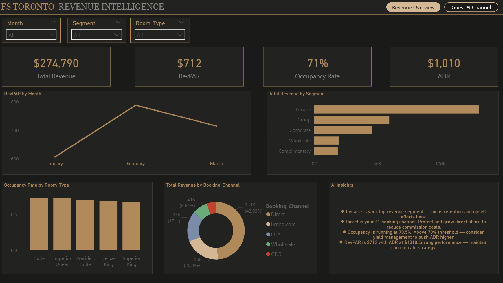
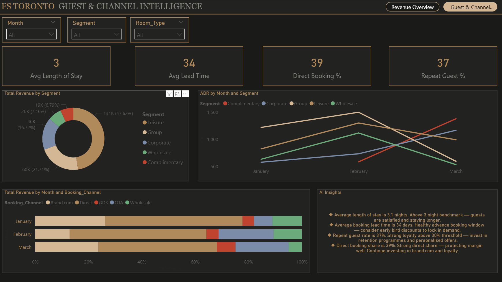

# FS Toronto · Revenue Intelligence Dashboard

> A luxury hotel revenue analytics project built with Excel, SQL and Power BI — designed to replicate the data workflows used by revenue managers at world-class hospitality brands like Four Seasons.

---

## Dashboard Preview

### Page 1 — Revenue Overview


### Page 2 — Guest & Channel Intelligence


---

## Project Overview

This project simulates a real-world hotel revenue analytics workflow for Four Seasons Toronto. It covers the full data analyst pipeline — from raw data construction and KPI formula building in Excel, to SQL querying, to a production-grade Power BI dashboard with a DAX-powered AI insights engine.

The goal was to build something that demonstrates genuine hospitality domain knowledge alongside technical analytical skills — not just charts, but the kind of revenue intelligence a General Manager or Director of Revenue would actually use in a weekly strategy meeting.

---

## Tools Used

| Tool | Purpose |
|------|---------|
| Microsoft Excel | Data construction, KPI formulas, structured table |
| MySQL Workbench | Database creation, data import, SQL queries |
| Power BI Desktop | Dashboard design, DAX measures, AI insights |
| GitHub | Version control and project documentation |

---

## Dataset

- **90 rows** of realistic Four Seasons Toronto booking data
- **14 columns** covering booking ID, check-in/out dates, room type, room rate, total revenue, guest segment, booking channel, lead time, nationality, rooms available/occupied, and repeat guest status
- Data spans **Q1 2026 (January — March)**
- Room types range from Superior Queen ($480–$560/night) to Presidential Suite ($2,600–$3,100/night)

---

## Key Metrics Calculated

| KPI | Value | Formula |
|-----|-------|---------|
| Total Revenue | $274,790 | SUM of all booking revenues |
| ADR (Average Daily Rate) | $1,010 | AVERAGE of nightly room rates |
| Occupancy Rate | 70.53% | Rooms Occupied / Rooms Available |
| RevPAR | $712.15 | ADR × Occupancy Rate |
| Avg Length of Stay | 3.1 nights | AVERAGE of length of stay |
| Avg Lead Time | 34 days | AVERAGE of booking lead time |
| Direct Booking % | 39% | Direct bookings / Total bookings |
| Repeat Guest % | 37% | Repeat guests / Total guests |

---

## SQL Queries

Five analytical queries were written in MySQL to validate and extend the Excel analysis:

1. **KPI Summary Query** — Total revenue, ADR, occupancy rate and RevPAR in a single query
2. **Revenue by Segment** — Grouped analysis showing Leisure, Corporate, Group, Wholesale and Complimentary performance
3. **Revenue by Booking Channel** — Channel mix analysis with booking share percentages
4. **Monthly Revenue Trend** — Jan–Mar performance breakdown with occupancy by month
5. **ADR by Room Type Ranking** — Window function (`RANK() OVER`) ranking all room types by average daily rate

---

## Power BI Dashboard

### Page 1 — Revenue Overview
- 4 KPI cards: Total Revenue, ADR, Occupancy Rate, RevPAR
- RevPAR monthly trend line chart
- Revenue by guest segment horizontal bar chart
- Occupancy rate by room type column chart
- Revenue by booking channel donut chart
- 3 interactive slicers: Month, Segment, Room Type
- DAX-powered AI insights panel that rewrites dynamically based on slicer selections

### Page 2 — Guest & Channel Intelligence
- 4 KPI cards: Avg Length of Stay, Avg Lead Time, Direct Booking %, Repeat Guest %
- Guest segment mix donut chart
- ADR by segment multi-line trend chart
- Revenue by booking channel stacked bar chart (monthly)
- DAX-powered AI insights panel with guest behaviour recommendations

### DAX Measures Built
- `Total Revenue` — SUM of Total_Revenue
- `ADR` — AVERAGE of Room_Rate
- `Occupancy Rate` — Rooms Occupied / Rooms Available
- `RevPAR` — ADR × Occupancy Rate
- `Avg Length of Stay` — AVERAGE of Length_of_Stay
- `Avg Lead Time` — AVERAGE of Lead_Time_Days
- `Direct Booking %` — DIVIDE with FILTER for Direct channel
- `Repeat Guest %` — DIVIDE with FILTER for Yes values
- `Insights` — Dynamic DAX text measure using TOPN, CONCATENATEX, IF and FORMAT
- `Insights Page 2` — Dynamic guest behaviour insights using VAR declarations and conditional logic

---

## Key Findings

- **Leisure** is the top revenue segment at $130,850 (47.6% of total revenue)
- **Group bookings** have the highest ADR at $1,205 — most valuable per-room guests despite lower volume
- **February** was the strongest month with RevPAR peaking at $771 — 27% above January
- **Direct bookings** lead channel mix at 39% — strong margin protection vs OTA commission drag
- **Occupancy at 70.53%** — above the 70% luxury hotel benchmark, indicating strong pricing power
- **Presidential Suite** generates $102,820 from only 12 bookings — highest revenue per booking

---

## Project Structure

```
FS-Revenue-Dashboard/
│
├── FS_Toronto_Revenue_Data.xlsx    # Excel workbook with booking data and KPI summary
├── FS_Toronto_Revenue_Data.csv     # CSV export for SQL import
├── queries.sql                     # All 5 SQL queries
├── FS_Revenue_Dashboard.pbix       # Power BI dashboard file
├── page1.png                       # Dashboard screenshot — Revenue Overview
├── page2.png                       # Dashboard screenshot — Guest & Channel Intelligence
└── README.md                       # This file
```

---

## About

Built by **Khushil Varsani** — Computer Programming graduate from Seneca Polytechnic, Toronto.
Aspiring Data Analyst with a passion for hospitality analytics and revenue intelligence.

Connect on LinkedIn · [github.com/khushil677](https://github.com/khushil677)
